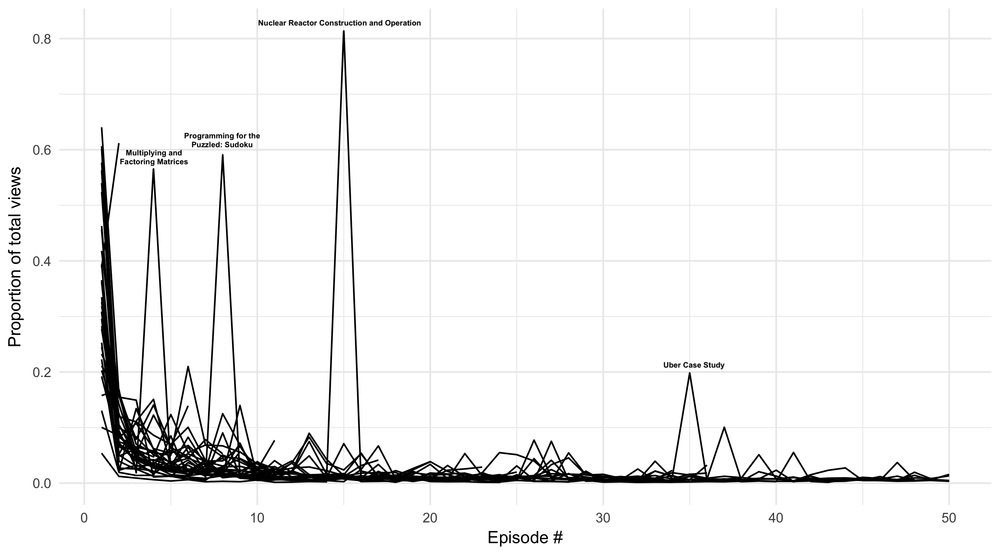

This basically means that lectures infrequent make it past the first lecture. This technically works out to an [average half life](https://github.com/SivanMehta/mit-ocw-stats/blob/master/scripts/half-life.R) of `2` days per course.

## TODO

Can use Youtube Data API
- [x] Get playlists from YouTube id `UCEBb1b_L6zDS3xTUrIALZOw` (MIT)
- [x] Filter playlists by course-like title `PLUl4u3cNGP62In5JXH39ct5JtXja3VGJJ`
- [x] List playlist items
- [x] Get Video IDs QTJuzevTGkQ
- [x] Get viewCount
- [x] Compile into a `.csv`
- [x] plot


`secret.json` should be in this form:

```json
{
  "api_key": "XXX"
}
```
